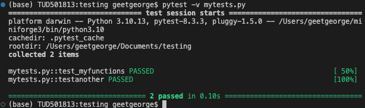

# Course evaluation

For this course (unless you're taking a resit exam for the course from 2023-24), the evaluation will be solely based on your project. There will be no written exam. 

Your project will only be evaluated if we can see your name and student number in the `README.md` file of your Github repository. The project will be evaluated based on the following criteria:

1. Project in a Github repository (make sure the teaching team invited)
2. Functions: Proper syntax and appropriate implementation
3. Commit history: Regular commits
4. README: Concept and method implemented by your code
5. Docstrings: Each function has an appropriate docstring
6. Tests for functions
7. Running pytest to check test success for project
8. Contains pyproject.toml file (with appropriate metadata and build section)

## Mid-term assessment

- For the mid-term assessment, please note that only the first 4 out of the 8 assessment criteria will be taken into account. This is also mentioned in the Brightspace announcement, where the assessment criteria were first presented. 

- When we will assess your projects for the mid-term, we do not expect that the project will be completed. It most probably is in a state of development. What is expected is that you already have some code developed (likely in one or more .py files), and that you have this code pushed to your Github repository. You also already have a `README.md` in that repository. 

- In your repository (not your profile settings), go to Settings -> Collaborators, and make sure the three TAs and I are invited and included as collaborators. If it is missing or if it still says "Pending invite" or something along those lines, send the invitations again for us to collaborate. For some of your invitations, we got a 404 error (i.e. the page doesn't exist), which makes me doubt that we are added to all projects in the course.

## Final assessment

- For the final assessment, all 8 assessment criteria will be taken into account. 

- The main objective behind the assessment will not be the perfection of the code, or the efficiency of your project. The main objective is to see that you have understood the concepts that were taught in the course, and that you can apply them to your project. So, for example, if you have a function that is not working, but you have a docstring that explains what the function should do, and you have a test for that function, you will still get points for that function. Note that this doesn't mean you should just have functions that are syntactically incorrect or don't make sense for your project, but it does mean that we will not be too harsh on the grading, if you have a function that is not exactly working as intended. The more important parts are the git history, the README, the docstrings, the tests, the TOML file.

- Along similar lines, if what you proposed originally seems too ambitious, and you have to scale down your project, that is fine. We will not be grading you on the ambition of your project, but on the execution of your project. 

- Having a single function (e.g. `main()`) in your whole project is not enough. You should have a project that is substantial enough to show that you have understood the concepts that were taught in the course. Remember that one function usually does only one thing. You can always have functions that call other functions, and that way you can build your project. At the end, you might have a `main()` function that calls all the other functions.

- For the testing, we will be looking at the output when you enter the command `pytest -v your-tests-file.py` (do not forget the `-v` option; if you need the `-s` option for your project, it'll be `-v -s` instead of just `-v`), which you should paste as a screenshot (JPG or PNG) in your `README.md`. It might look something like the image below. If you have a test that is failing, but you have a good reason for it, go ahead and explain that in your README. But even if you cannot explain it, that's not a problem. It is better to have a failing test than to have no test at all. Again, our assessment will be based on concept implementation, i.e. more on the fact that you have tests for functions, not on the fact that all your tests are passing. Do not take this as an excuse to write any test that you want. The tests should be meaningful and should test the intended behaviour of your functions. 
