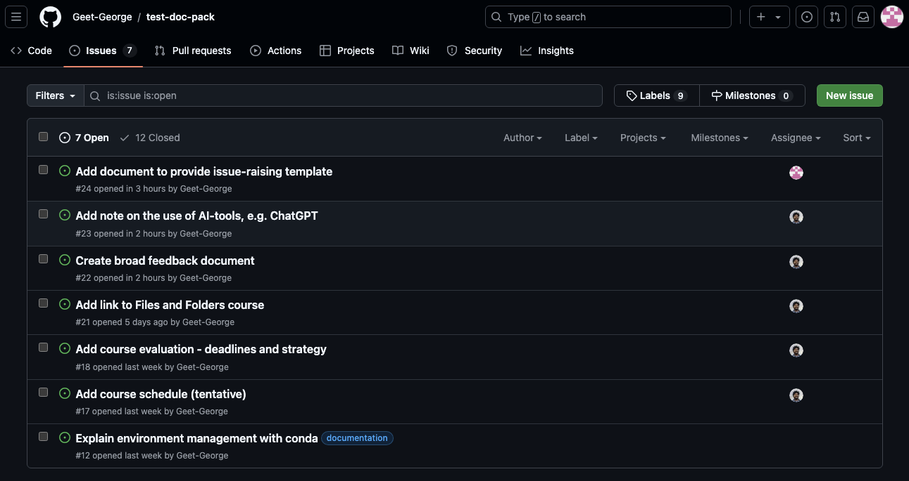
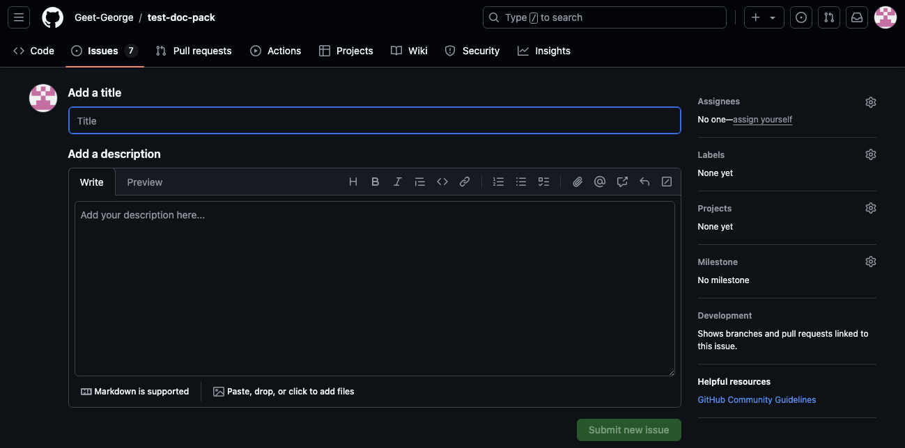

# How to raise an issue

The standard way of asking questions, reporting bugs or requesting features is to raise an issue on the relevant repository. You can raise issues at the `Issues` tab in the upper bar of any repository 

To open a new issue, simply click the green `New issue` button, which will open the following screen

Here you can give the issue a title and write a description. These descriptions are often standardized across a repository. We will stick to a standarized issue template of our own.

To ask a question you can open a new issue and copy/fill in the issue template below. Copy the raw markdown text rather than copy pasting the rendered text. Before you submit a new issue, you may preview the description using the `Preview` button to check whether pictures, links etc. have rendered properly. Also, make sure to assign the relevant people (for our course, tag at least someone of the teaching team) on your new issue, else it may lie dormant in perpetuity! 

# Template

### 1. Issue Description

A clear and concise description of what the issue is.

### 2. Steps to Reproduce 

Please list the steps required to reproduce the bug, including:
1. Step one
2. Step two
3. Step three

### 3. Expected Behavior

What did you expect to happen? 

### 4. Actual Behavior 

What actually happened instead? 

### 5. Screenshots and Code snippets (optional)

If applicable, add screenshots, code snippets and/or full traceback errors

### 6. Environment

Please provide the following details for troubleshooting:
- Operating system (e.g., Windows, macOS, Linux)
- Version of the software/library (if applicable)

### 7. Additional Context

Add any other context or information about the issue or feature request here.

### 8. Checklist

- [ ] I have assigned a reviewer.
- [ ] I have searched the interwebs for this question.
- [ ] I have provided sufficient information above to investigate.

